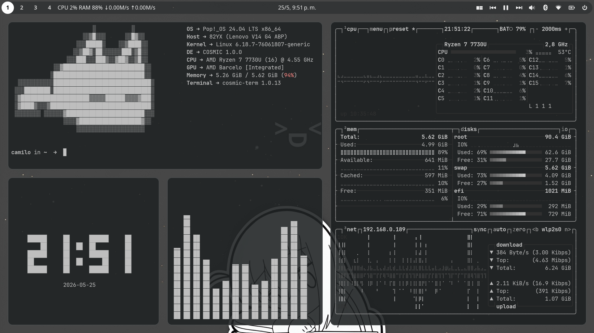

Hi I love COSMIC DE so I'm going to save my settings here 

# WHAT I DID ON MY DESKTOP WAAA
- Removed `cosmic-dock`
- Separated the panel and made it 50% transparent
- Set this [wallpaper](https://github.com/CapiNauta297/Dotfiles-epikos-tremendos/blob/main/wallpapers/fondo%20epiko%20me%20encanta.jpg) 
- Added some applets from the `cosmic-store`
  - **Sysinfo**, to see my CPU, RAM and network usage
  - **Media Player** from the native Sound Applet
  - **Numbered Workspaces** to view my workspaces
- Changed my desktop color from Cosmic Settings to a pure white (`#DFDFDF`) with a grey background (`#1F2324`) 
- Btw, you can find my config [here](https://github.com/CapiNauta297/Dotfiles-epikos-tremendos/blob/main/escritorio.ron) (If you want to import it, just download the `.ron` file and import it in the settings)

## SCREENSHOTS

### Desktop

### CLI Tools Setup

### Media & Browser

### Work ;)

## ADDITIONALS
- **CLI TOOLS I USED** ([Second image](./screenshots/Screenshot_2026-05-23_12-27-49.png))
  - I use `cosmic-term` with Mono Nerd Font
  - [**Fastfetch**](https://github.com/fastfetch-cli/fastfetch)
  - [**Cava**](https://github.com/karlstav/cava)
  - [**tty-clock**](https://github.com/xorg62/tty-clock) (My command: `tty-clock -c -C 7`)
  - [**Btop**](https://github.com/aristocratos/btop) with `greyscale` Theme

- **Extension [ThemeSong for Youtube Music](https://addons.mozilla.org/en-US/firefox/addon/themesong-for-youtube-music/)** with the browser **[Zen Browser](https://zen-browser.app/)** ([Third image](./screenshots/Screenshot_2026-05-23_12-29-54.png))

> Thanks for checking my rice :)

Note: English is not my first language, so I used a translator :)))
