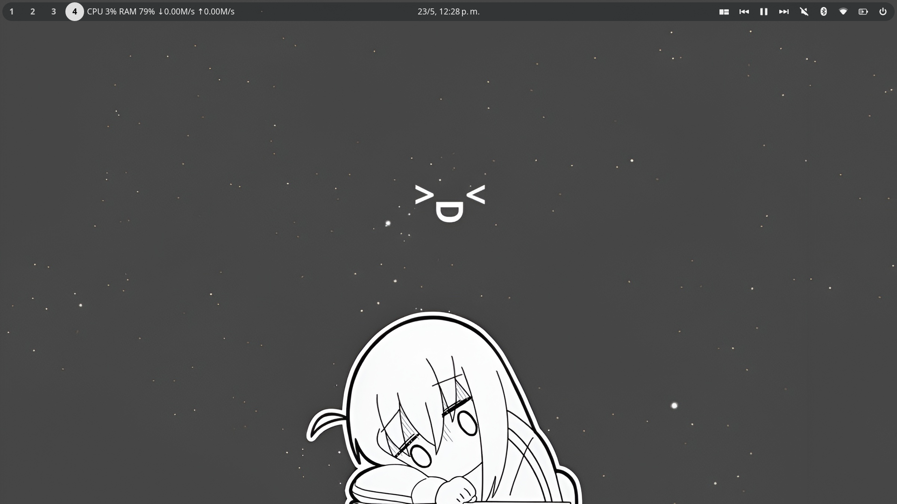
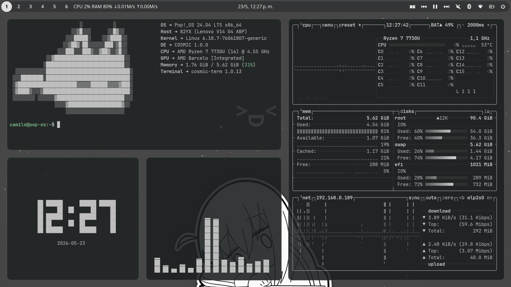
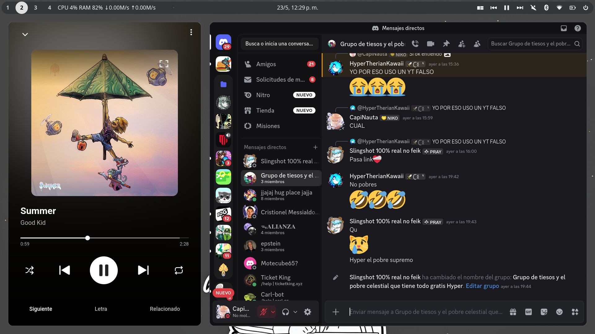
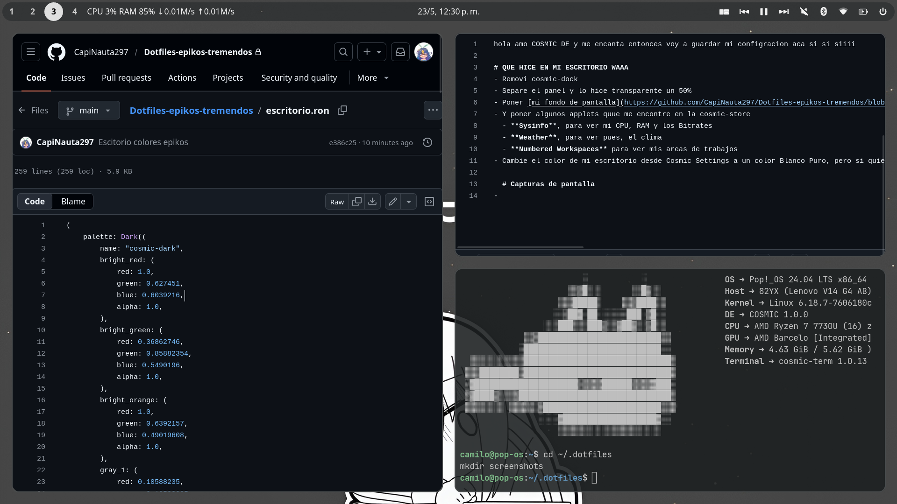

Hi I love COSMIC DE so I'm going to save my settings here 

# WHAT I DID ON MY DESK WAAA
- Remove cosmic-dock
- I separated the panel and made it 50% transparent
- Set my [wallpaper](https://github.com/CapiNauta297/Dotfiles-epikos-tremendos/blob/main/wallpapers/fondo%20epiko%20me%20encanta.jpg)
-And add some applets that I found in the cosmic-store
  - **Sysinfo**, to see my CPU, RAM and Bitrates
  - **Multimedia Player** of the Sound Applet
  - **Numbered Workspaces** to view my workspaces
- I changed my desktop color from Cosmic Settings to a pure white with a grey background, but you can see the colors [here](https://github.com/CapiNauta297/Dotfiles-epikos-tremendos/blob/main/escritorio.ron) (If you want to import it, just download the .ron file and import it in the settings)

# SCREENSHOTS

# ADDITIONALS
- **CLI TOOLS I USED** (Second image)
  - **Fastfetch**
  - **Cava**
  - **tty-clock**
  - **Btop** (theme greyscale)

- **Extension [ThemeSong for Youtube Music](https://addons.mozilla.org/en-US/firefox/addon/themesong-for-youtube-music/)** with **[Zen Browser](https://zen-browser.app/)** (Third image)

> Thanks for see my rice :)

note: I don't speak English, so I used a translator :(
